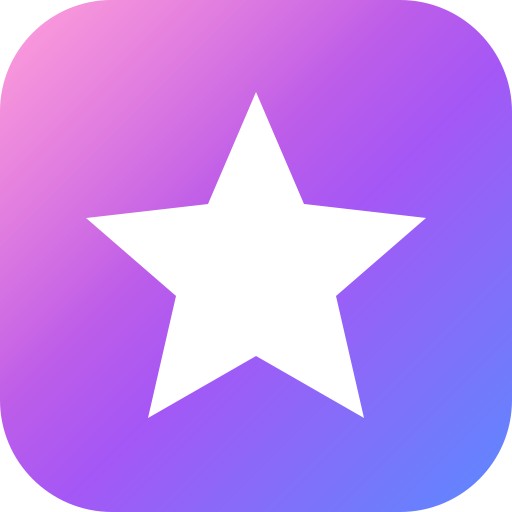
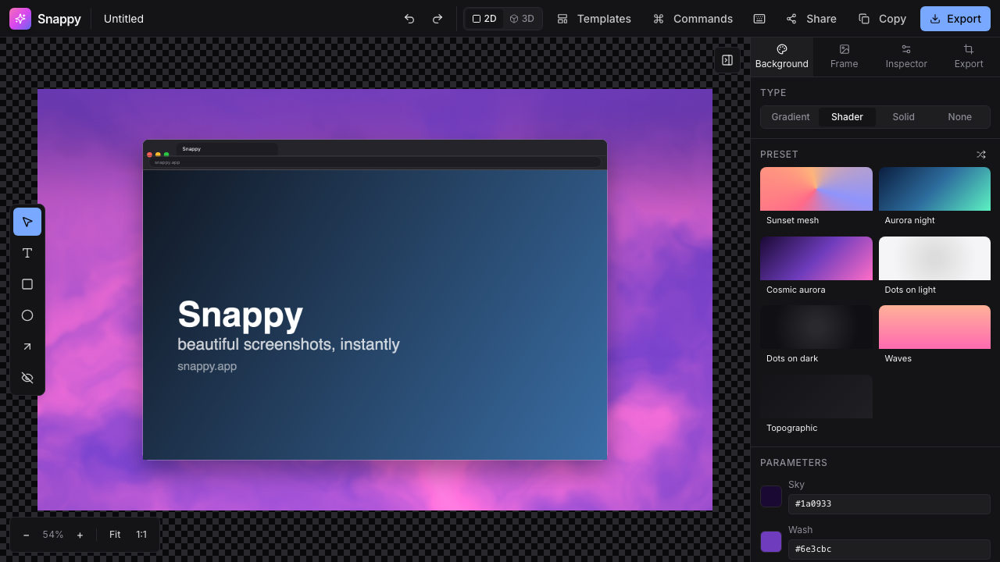
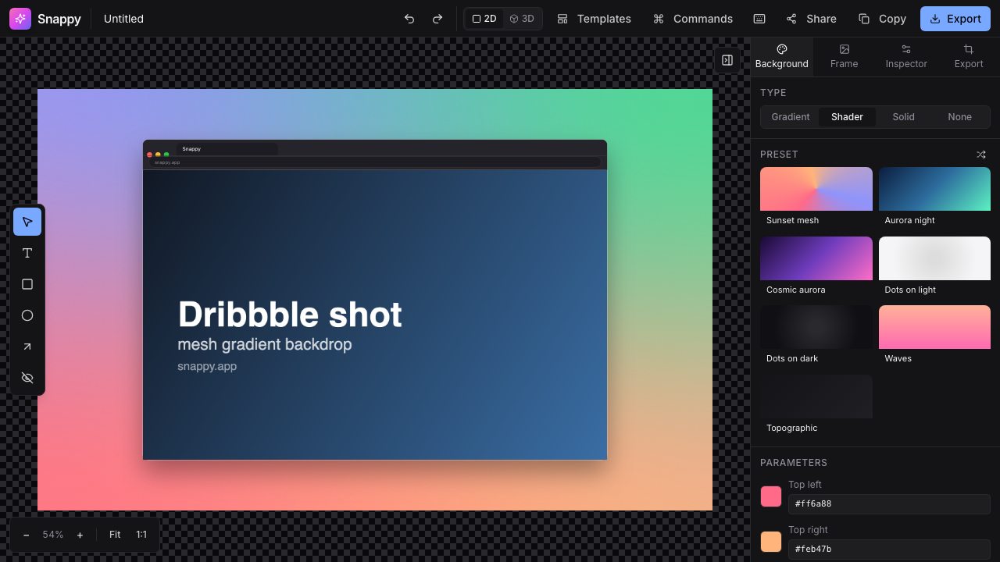
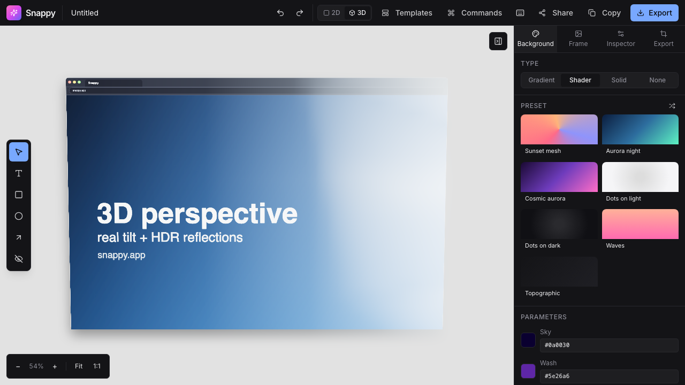
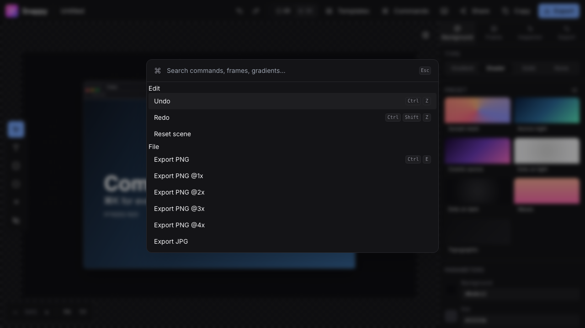
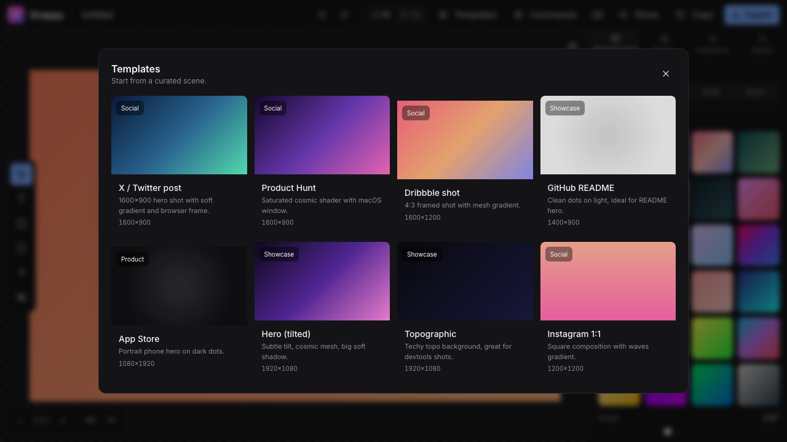
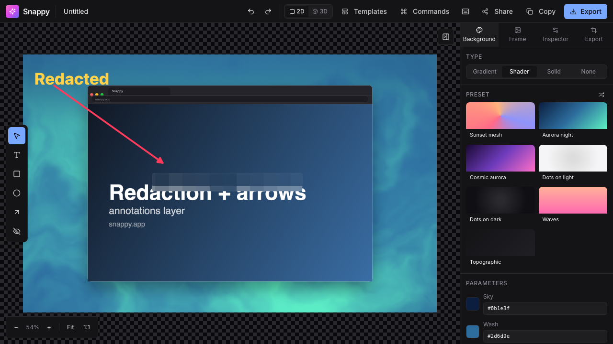

<div align="center">
  
  <h1>Snappy</h1>
  <p><strong>Turn any screenshot into a beautiful shareable image.</strong></p>
  <p>100% client-side · free · open source · no signup · local storage only.</p>
</div>

<p align="center">
  
</p>

---

Snappy is a browser-native screenshot beautifier. Drop in a PNG, pick a device frame, a gradient or WebGL shader background, tilt it in real 3D, redact sensitive bits, and export a PNG at any resolution — all in a single tab, offline-capable, with zero network calls after the first page load.

It's built as a "100×-better" take on shots.so: faster, more differentiated, keyboard-first, genuinely offline, and MIT-licensed.

## Why Snappy

- **No backend.** Your screenshots never leave your browser. Documents and assets persist locally in IndexedDB.
- **Real perspective 3D.** Tilt the device in actual 3D space with HDR reflections and contact shadows. One keystroke flip between 2D and 3D.
- **WebGL shader backgrounds.** 7 preset shaders (aurora, mesh, dot grid, waves, topographic…) with live parameter sliders — infinite variations, never stock.
- **Zero lag, zero bug.** Export runs on an OffscreenCanvas + Web Worker — a 4K@4× export on a busy scene keeps the UI at a steady 60fps.
- **Keyboard-first.** ⌘K opens a fuzzy-search command palette for every action, frame, shader, template, and theme.
- **Annotations that matter.** Text, shapes, arrows, and a **blur-mask** that actually pixelates the underlying screenshot so redactions survive export.
- **Offline + installable.** Full PWA with a service worker; install it as a desktop app and it still works on a plane.

## Screenshots

<table>
  <tr>
    <td width="50%"></td>
    <td width="50%"></td>
  </tr>
  <tr>
    <td><strong>Shader backgrounds</strong> — 7 WebGL presets, live params, randomizable seeds.</td>
    <td><strong>3D scene mode</strong> — real perspective + HDR reflections + contact shadow.</td>
  </tr>
  <tr>
    <td></td>
    <td></td>
  </tr>
  <tr>
    <td><strong>Command palette</strong> — ⌘K for every action.</td>
    <td><strong>Templates</strong> — X/Twitter, Product Hunt, Dribbble, README, App Store…</td>
  </tr>
  <tr>
    <td colspan="2"></td>
  </tr>
  <tr>
    <td colspan="2"><strong>Annotations + blur mask</strong> — arrows, text callouts, shapes, and a real pixelation-based redaction layer.</td>
  </tr>
</table>

## Quick start

```bash
npm install
npm run dev          # http://localhost:5173
npm run build        # static bundle in dist/
npm run preview      # serve the build locally
npm run check        # the full CI-equivalent gate
```

Requirements: **Node 20+**, npm 10+.

## Features

<details>
<summary><strong>Canvas &amp; input</strong></summary>

- Drag-drop, paste (⌘V), or click-to-upload an image
- Auto-detect device type from aspect ratio and suggest a matching frame
- Zoom (⌘-wheel or keys), pan (space-drag), fit-to-view (F), actual-size (1)
- 50-step undo/redo (⌘Z / ⌘⇧Z) via [zundo](https://github.com/charkour/zundo)
</details>

<details>
<summary><strong>Device frames</strong></summary>

- macOS window · Chrome · Safari · iPhone 15 Pro · MacBook 14" · floating · none
- Hand-tuned SVG chrome with customizable tab title, URL, window buttons, dark/light
- Bezel-style frames (iPhone, MacBook) with proper outer body + inner content clip + Dynamic Island / camera dot
</details>

<details>
<summary><strong>Backgrounds</strong></summary>

- 24 curated gradient presets, custom linear gradient with angle + color stops
- Solid color picker
- Mesh gradient (4-corner blend)
- **WebGL shader library**: Sunset mesh · Aurora night · Cosmic aurora · Dots (light / dark) · Waves · Topographic — all with live parameter sliders and randomizable seed
- Image background (cover / contain / tile)
- Transparent for direct export
</details>

<details>
<summary><strong>3D scene mode</strong></summary>

- Toggle 2D ↔ 3D with `3` or the Topbar button
- Four camera presets: **Hero**, **Floating**, **Angled**, **Isometric** — with smooth damped transitions
- HDR environment presets: studio · city · sunset · warehouse · apartment · night
- Per-axis manual tilt override, elevation, camera distance, shadow strength, bloom
- Real contact shadow under the device + physically-based clearcoat material with env reflections
</details>

<details>
<summary><strong>Annotations</strong></summary>

- Text callouts, rectangles, ellipses, arrows with arrowhead math
- **Blur-mask annotation** — samples a cached mosaic of the underlying screenshot for real redaction that bakes into exports
- Konva Transformer for select / resize / rotate (per-type enabled anchors)
- Lock / duplicate (⌘D) / delete / nudge with arrow keys
- Annotation inspector with per-type properties (text size, stroke width, corner radius, pixel size, etc.)
</details>

<details>
<summary><strong>Export</strong></summary>

- PNG (1× / 2× / 3× / 4×), JPG with quality slider, WebP with quality slider, SVG (2D-only scenes, best-effort)
- **Worker export pipeline** — OffscreenCanvas + Web Worker; UI stays at 60fps during 4K@4× export (measured: zero dropped frames on a 3-second export)
- Copy-to-clipboard (⌘⇧C) via `navigator.clipboard.write` with `image/png`
- In 3D mode, exports come from the live r3f canvas with `preserveDrawingBuffer: true`
- Single canonical renderer for preview + export — no DOM-to-image, no divergence
</details>

<details>
<summary><strong>Sharing &amp; persistence</strong></summary>

- Share URL: `lz-string`-compressed document in the URL hash (`/#/s/<payload>`) with a 4 KB cap
- Autosave to IndexedDB (via [Dexie](https://dexie.org/)) every 750 ms of idle
- Last document auto-reopens on reload
- Schema versioning with pure-function migrations (currently v1 → v2)
</details>

<details>
<summary><strong>Keyboard shortcuts</strong></summary>

| Action | Shortcut |
|---|---|
| Command palette | ⌘K |
| Templates | ⌘T |
| Toggle 3D | 3 |
| Select / Text / Rect / Ellipse / Arrow / Blur | V / T / R / O / A / B |
| Duplicate selection | ⌘D |
| Delete selection | ⌫ / Delete |
| Deselect | Esc |
| Undo / Redo | ⌘Z / ⌘⇧Z |
| Paste image | ⌘V |
| Export / Copy | ⌘E / ⌘⇧C |
| Fit to view / Actual size | F / 1 |
| Zoom in / out | ⌘= / ⌘− |
| Toggle right panel | ⌘\ |
| Toggle theme | ⌘⇧D |
| Show shortcuts | ? |

</details>

## Architecture

```
src/
├── types/               Document + Layer + Annotation discriminated unions
├── store/               Four separate Zustand stores (document, editor, asset, settings)
├── canvas/              Rendering — Konva 2D preview + r3f 3D (lazy chunk)
│   ├── Stage.tsx        Main Konva Stage with layered render
│   ├── annotations/     Interactive annotations, Transformer wiring, blur mosaic
│   ├── backgrounds/     Shader canvas renderer bridged to Konva Image
│   ├── three/           r3f Canvas + Scene + DeviceMesh + CameraRig + presets
│   └── shaders/         GLSL fragment sources + WebGL2 runtime
├── components/          React UI (no Konva / no Three here)
│   ├── panels/          Background, Frame, Inspector (→ Screenshot / Annotation / 3D), Export
│   ├── Topbar.tsx       · AnnotationToolbar · CommandPalette · TemplatesModal · Onboarding · ShortcutsModal
│   └── ui/              Slider, NumberInput, ColorInput, Segmented
├── lib/                 Pure TypeScript, no React — safe for Web Workers
│   ├── db/              Dexie wrapper + schema migrations
│   ├── render/          Pure-canvas renderer shared by worker + main thread
│   ├── export/          Unified export entry + worker client + clipboard
│   ├── share/           URL codec (lz-string)
│   ├── image/           Decoding + aspect detection
│   └── presets/         Frames · gradients · shaders · templates · canvas sizes
├── workers/             OffscreenCanvas export worker (and future palette worker)
└── routes/              EditorRoute, ShareRoute (`/#/s/<payload>` hydration)
```

**Invariants enforced in code review:**
- `canvas/` never imports React chrome. `components/` never imports Konva or Three.
- `lib/` is pure TS, zero React. Used by both the main thread and the export Worker.
- Document state (undoable, serializable) is strictly separate from editor state (ephemeral).

## Tech stack

- **Build**: Vite 5 + React 18 + TypeScript strict (`noUncheckedIndexedAccess`, etc.)
- **State**: Zustand + zundo (undo/redo) + Immer
- **2D canvas**: Konva + react-konva
- **3D canvas**: Three.js r169 + @react-three/fiber 8 + @react-three/drei (lazy-loaded chunk)
- **Persistence**: Dexie (IndexedDB)
- **UI**: Tailwind v3 + cmdk + lucide-react
- **PWA**: vite-plugin-pwa + Workbox
- **Tests**: Vitest + @testing-library + happy-dom + Playwright (E2E + dHash export golden)
- **Lint / format**: Biome (one tool instead of ESLint + Prettier)
- **Deploy**: Vercel static

## Bundle

Split per-feature; the 3D chunk only loads when the user enters 3D mode:

| Chunk | gzipped |
|---|---|
| konva | 87 KB |
| react | 51 KB |
| index (app entry) | 52 KB |
| db (dexie + lz-string) | 33 KB |
| state | 4 KB |
| export worker | 7 KB |
| **→ Total 2D mode** | **~230 KB** |
| three (lazy) | 171 KB |
| @react-three/fiber + drei (lazy) | 63 KB |
| ThreeStage (lazy) | 5 KB |
| **→ Total with 3D loaded** | **~470 KB** |

Budgets enforced in [scripts/check-bundle.mjs](scripts/check-bundle.mjs); CI fails PRs that push any chunk over its cap.

## Testing

Unit tests (Vitest): `npm test` — 47 tests covering utilities, stores, share codec, render math, template merge, migrations.

E2E (Playwright): `npm run e2e` — 8 scenarios: smoke, shortcuts, template apply, annotation CRUD + undo/redo, annotation inspector, worker PNG validity, **dHash export golden with ±8-bit tolerance**.

See [CONTRIBUTING.md](CONTRIBUTING.md) for architecture invariants, how to update goldens, and how to add shaders / frames / templates.

## Deploying

See [DEPLOYMENT.md](DEPLOYMENT.md) for the full guide. Short version:

```bash
# Vercel (recommended)
npx vercel --prod

# Any static host
npm run build && ship dist/
```

## Roadmap

v1.1 candidates (none blocks launch):
- Auto-palette: extract a palette from the screenshot (k-means in a Worker) and harmonize the background
- Smart crop: detect and strip OS chrome (macOS traffic lights, taskbar) with one toggle
- GIF / WebM export for animated shader backgrounds
- Figma / Framer bridge for one-click import

## License

[MIT](LICENSE). Use it, fork it, embed it.

<p align="center"><sub>Made with Snappy. 🌟</sub></p>
